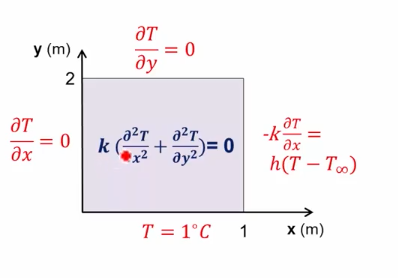

# Two Dimensional Steady Heat Conduction in a Block 

Find the temperature distribution.

 

## Pre - Analysis

### Governing Equations

**Mathematical Model**:

$$\frac{\partial^2 T}{\partial x^2} + \frac{\partial^2 T}{\partial y^2} = 0$$

**Boundary Conditions**:

$$\frac{\partial T}{\partial x} \Big|_{x = 0} = 0 \quad -k \frac{\partial T}{\partial x} \Big|_{x = 1} = h \left( T - T_\infty \right)$$

$$T(x, 0) = 1.0 \quad \frac{\partial T}{\partial y} \Big|_{y = 2} = 0$$

where $k = 1.0 W / m \degree C$, $h =5.0 W / m^2 \degree C$ and $T_\infty = 0.0 \degree C$.

### Hand Calculations

**Expected Results**:

* $q_x$ at left boundary: 0.0

* $q_y$ at top boundary: 0.0

* $q_x$ at bottom boundary: 0.0

 

## Numerical Solution

Analysis System: Steady-State Thermal

### TODO: Create Geometry

* Geometry -> Properties -> Analysis Type: 2D 

* Geometry -> SpaceClaim:

  * File -> SpaceClaim Options -> Units -> Length: Meters

  * Select sketch plane: XY

  * Set plane view

  * Rectangle -> Draw Rectangle (2m height, 1m length)

### TODO: Create Mesh

* Model:

  * Mesh -> Mesh Control:

    * Face Meshing.

    * Sizing -> Element Size: 0.25 m

  * Mesh -> Sizing -> Using Adaptive Sizing: Yes.

  * Advanced Size Function: Off

### TODO: Set Boundary Conditions

* Setup -> Steady State Thermal:

  * Temperature:

    * Geometry: Bottom edge | Temperature: 1.0

  * Convection:

    * Geometry: Right edge

    * Film Coefficient: 5.0

    * Ambient Temperature: 0.0

### TODO: Set Material

* Engineering Data -> New Material: material0

  * Isotropic Thermal Conductivity: 1

* Setup -> Geometry -> Material -> material0

### TODO: Run Calculations

* Solution: Solve

### TODO: Temperature Distribution

* Solution -> Thermal -> Temperature

### TODO: Heat Flux

* Solution -> Thermal -> Total Heat Flux

### TODO: Temperature and Heat Flux Plots Along Line

* Model -> Construction Geometry -> Path: line:

  * Number of Sampling Points: 49

  * Start Point: (0, 1) 

  * End Point: (1, 1)

* Solution -> Thermal -> Temperature:

  * Scoping Method: Path

* Solution -> Thermal -> Total Heat Flux:

  * Scoping Method: Path

  * Display Option: Unaveraged

 

## Verification & Validation

### TODO: Calculate Reaction

* Result: Solution -> Probe -> Reaction -> Temperature

  * Boundary Condition: Bottom Edge

  * Heat: 1.6701 W

* Result: Solution -> Probe -> Reaction -> Convection

  * Boundary Condition: Right Edge

  * Heat: -1.6701 W

### TODO: Mesh Refinement

|     |Mesh Size = 0.25| Mesh Size = 0.125|
|----:|:---------------|:----------------:|
|Min T|        $0.0455$|          $0.0454$|
|Max q|        $5.0674$|          $6.8797$|

 
